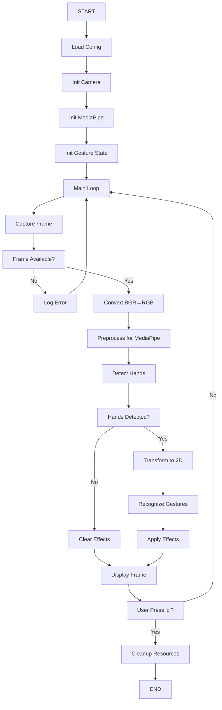
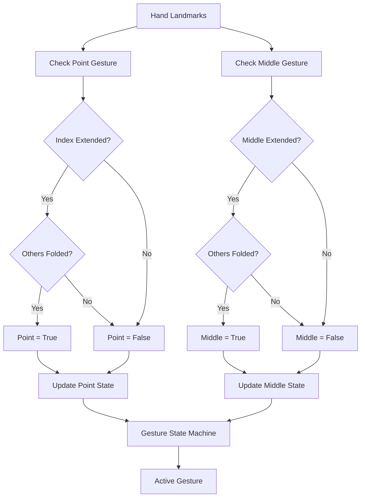
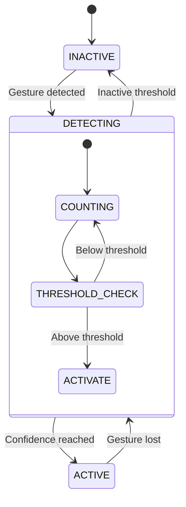
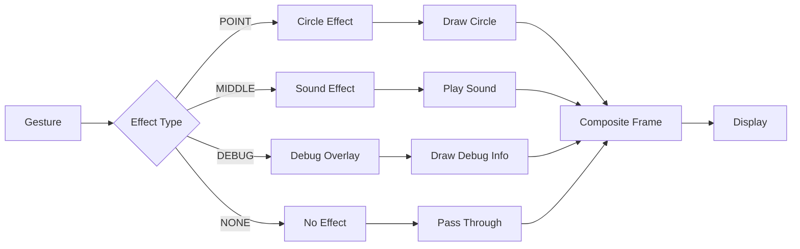
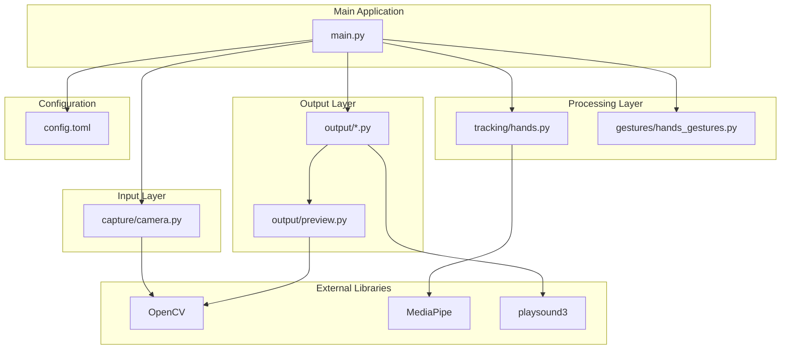
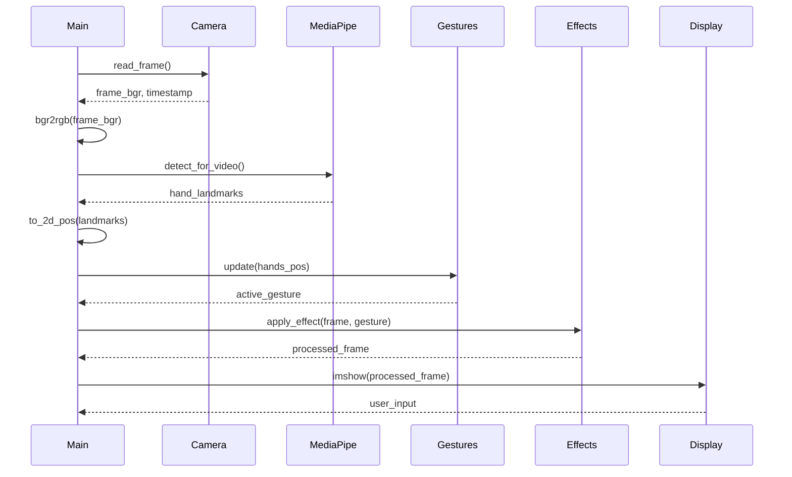

# ТЕХНИЧЕСКАЯ ДОКУМЕНТАЦИЯ WebcamFX

## 1. ЦЕЛИ ПРОЕКТА

### 1.1 Основные цели
- **Создание десктопного приложения** для обработки видеопотока с вебкамеры в реальном времени
- **Реализация распознавания жестов рук** с использованием компьютерного зрения
- **Наложение визуальных и звуковых эффектов** на основе распознанных жестов
- **Обеспечение интерактивного взаимодействия** пользователя с приложением через жесты

### 1.2 Технические цели
- **Достижение производительности 30+ FPS** при обработке видео в реальном времени
- **Обеспечение кросс-платформенности** (Windows, macOS, Linux)
- **Создание модульной архитектуры** для лёгкого расширения функционала
- **Реализация точного распознавания жестов** с минимальной задержкой

## 2. ОПИСАНИЕ ФУНКЦИОНАЛА ПРОЕКТА

### 2.1 Основной функционал

#### 2.1.1 Захват и обработка видео
- **Инициализация вебкамеры** с настраиваемым разрешением и FPS
- **Получение кадров** в реальном времени через OpenCV
- **Конвертация цветовых пространств** BGR→RGB для MediaPipe совместимости
- **Обработка исключений** при потере соединения с камерой

#### 2.1.2 Трекинг рук
- **Детекция рук** с использованием MediaPipe HandLandmarker
- **Отслеживание 21 landmark** на каждой руке
- **Преобразование 3D координат** в 2D экранные координаты
- **Поддержка до 1 руки одновременно**

#### 2.1.3 Распознавание жестов
- **Жест "POINT"**: Указательный палец вытянут, остальные согнуты
- **Жест "MIDDLE"**: Средний палец вытянут, остальные согнуты
- **Сглаживание активации**
- **Настраиваемые пороги** уверенности распознавания

#### 2.1.4 Визуальные эффекты
- **Отрисовка скелета руки**: 21 точка и соединительные линии
- **Эффект для указательного пальца**: Цветной круг на кончике
- **Настройка параметров эффектов**: цвет, размер, толщина
- **Отладочная визуализация**: метрики производительности и состояние

#### 2.1.5 Звуковые эффекты
- **Асинхронное воспроизведение** звуков без блокировки основного потока
- **Поддержка различных аудиоформатов** (MP3, WAV, OGG)
- **Настраиваемая библиотека звуков** для разных жестов

### 2.2 Детальное описание функций

#### 2.2.1 Функция захвата видео
```python
def capture_video():
    """
    Захватывает видеопоток с вебкамеры
    
    Returns:
        frame_bgr: Кадр в формате BGR
        timestamp: Временная метка в миллисекундах
    """
```
**Входные параметры:**
- `camera_id`: ID устройства камеры (0 по умолчанию)
- `resolution`: Ширина x высота (800x600 по умолчанию)
- `fps`: Желаемая частота кадров (30 по умолчанию)

**Выходные данные:**
- `frame_bgr`: numpy array shape (height, width, 3) в формате BGR
- `timestamp`: int временная метка для MediaPipe

**Обработка ошибок:**
- `RuntimeError`: Если камера не доступна
- `None`: Если не удалось прочитать кадр

#### 2.2.2 Функция трекинга рук
```python
def track_hands(frame_rgb, timestamp):
    """
    Отслеживает руки на кадре
    
    Args:
        frame_rgb: Кадр в формате RGB
        timestamp: Временная метка
        
    Returns:
        hands_landmarks: Список 21 точки для каждой обнаруженной руки
        confidence: Уверенность обнаружения (0.0-1.0)
    """
```

**Алгоритм работы:**
1. Предобработка кадра для MediaPipe
2. Детекция рук с помощью HandLandmarker
3. Преобразование в 2D координаты

#### 2.2.3 Функция распознавания жестов
```python
def recognize_gesture(hands_pos):
    """
    Распознает жест на основе положения рук
    
    Args:
        hands_pos: HandsPos объект с 21 точкой
        
    Returns:
        gesture: "POINT", "MIDDLE" или None
        confidence: Уверенность распознавания
    """
```

**Логика распознавания:**
- **POINT**: index_finger_tip.y < index_finger_pip.y И остальные пальцы согнуты
- **MIDDLE**: middle_finger_tip.y < middle_finger_pip.y И остальные пальцы согнуты
- **Сглаживание**: Требуется N последовательных кадров для активации

### 2.3 Пользовательские сценарии

#### 2.3.1 Сценарий "Интерактивная презентация"
1. Пользователь запускает приложение
2. Поднимает указательный палец → появляется красный круг
3. Двигает рукой → круг следует за пальцем
4. Опускает палец → эффект исчезает

#### 2.3.2 Сценарий "Развлекательный стрим"
1. Включается режим с звуковыми эффектами
2. Пользователь показывает средний палец
3. Проигрывается звуковой эффект
4. В чате появляются реакции на эффект

#### 2.3.3 Сценарий "Обучение жестам"
1. Включается отладочный режим
2. Отображается скелет руки и состояние жестов
3. Пользователь практикует жесты
4. Система показывает метрики точности

## 3. АРХИТЕКТУРА

### 3.1 Общая архитектура системы

```
┌─────────────────────────────────────────────────────────────┐
│                    WEBCAMFX APPLICATION                     │
├─────────────────────────────────────────────────────────────┤
│  MAIN LOOP (main.py)                                        │
│  ┌─────────────┐ ┌─────────────┐ ┌─────────────┐           │
│  │   CAMERA    │ │   TRACKING  │ │   EFFECTS   │           │
│  │ CAPTURE     │ │   HANDS     │ │   RENDER    │           │
│  └─────────────┘ └─────────────┘ └─────────────┘           │
├─────────────────────────────────────────────────────────────┤
│  CONFIGURATION LAYER (config.toml)                         │
├─────────────────────────────────────────────────────────────┤
│  HARDWARE ABSTRACTION LAYER                                │
│  ┌─────────────┐ ┌─────────────┐ ┌─────────────┐           │
│  │   CAMERA    │ │    AUDIO    │ │    GUI      │           │
│  │   DRIVER    │ │   SYSTEM    │ │   SYSTEM    │           │
│  └─────────────┘ └─────────────┘ └─────────────┘           │
├─────────────────────────────────────────────────────────────┤
│  EXTERNAL LIBRARIES                                         │
│  ┌─────────────┐ ┌─────────────┐ ┌─────────────┐           │
│  │   OpenCV    │ │ MediaPipe   │ │ playsound3  │           │
│  │             │ │             │ │             │           │
│  └─────────────┘ └─────────────┘ └─────────────┘           │
└─────────────────────────────────────────────────────────────┘
```

### 3.2 Модульная архитектура

#### 3.2.1 Модуль capture/
**Ответственность:** Захват видео с вебкамеры
```python
capture/
├── __init__.py
├── camera.py          # Основные функции работы с камерой
└── device_manager.py  # Управление устройствами (будущее)
```

**Ключевые функции:**
- `open_camera(cam_id, w, h, fps)` - инициализация камеры
- `read_frame(capture)` - чтение кадра
- `release(capture)` - освобождение ресурсов

**Зависимости:**
- OpenCV (cv2)
- Встроенные библиотеки (time)

#### 3.2.2 Модуль tracking/
**Ответственность:** Трекинг и обработка данных о руках

**Ключевые классы:**
- `HandsPos` - 21 точка руки в 2D
- `pos2d` - 2D координата (x, y)

**Ключевые функции:**
- `init(path, hand_conf, tracking_conf)` - инициализация детектора
- `track(detector, mp_image, timestamp)` - трекинг
- `to_2d_pos(landmarks, w, h)` - преобразование координат

#### 3.2.3 Модуль gestures/
**Ответственность:** Распознавание и классификация жестов

**Ключевые классы:**
- `GestureState` - состояние всех жестов с сглаживанием

**Ключевые функции:**
- `check_point(hands_pos)` - проверка жеста "указательный"
- `check_middle(hands_pos)` - проверка жеста "средний"
- `update(hands_pos, confidence, threshold)` - обновление состояния

#### 3.2.4 Модуль output/

**Ключевые функции:**
- `open_preview(frame)` - отображение кадра
- `draw_lm(frame, hands_pos)` - отрисовка точек
- `draw_lines(frame, hands_pos)` - отрисовка линий
- `draw_circle(frame, color, radius, pos)` - эффект круга

#### 3.2.5 Модуль utils/
**Ответственность:** Вспомогательные утилиты

### 3.3 Поток данных в системе

```
Camera Frame (BGR) 
    ↓
Color Conversion (BGR→RGB)
    ↓
MediaPipe Processing
    ↓
Hand Landmarks (3D)
    ↓
Coordinate Transform (3D→2D)
    ↓
Gesture Recognition
    ↓
Effect Application
    ↓
Final Frame (BGR)
    ↓
Display Output
```

### 3.5 Управление конфигурацией

#### 3.5.1 Структура конфигурации
```toml
[camera]
id = 0
w = 800
h = 600
fps = 30

[output]
debug = true
show_lines = true
show_landmarks = false

[hands.model]
hands_path = "hand_landmarker.task"

[hands.confidence]
hand_confidence = 0.6
tracking_confidence = 0.6
gesture_confidence = 5
inactive_threshold = 2

[hands.gestures.point]
enabled = true
color = [255, 0, 0]
radius = 20
thickness = 5

[sfx]
funny_mode = false
[sfx.middle]
path = "sfx/faaah.mp3"
```

#### 3.5.2 Класс конфигурации
```python
class Config:
    # Camera settings
    cam_id = config["camera"]["id"]
    w = config["camera"]["w"]
    h = config["camera"]["h"]
    fps = config["camera"]["fps"]
    
    # Hand tracking settings
    hands_path = config["hands"]["model"]["hands_path"]
    hand_confidence = config["hands"]["confidence"]["hand_confidence"]
    tracking_confidence = config["hands"]["confidence"]["tracking_confidence"]
    
    # Gesture settings
    gesture_confidence = config["hands"]["confidence"]["gesture_confidence"]
    inactive_threshold = config["hands"]["confidence"]["inactive_threshold"]
```

## 4. ФУНКЦИОНАЛЬНАЯ СХЕМА

### 4.1 Схема основного цикла обработки



### 4.2 Схема распознавания жестов



### 4.3 Схема управления состоянием жестов



### 4.4 Схема обработки эффектов



### 4.5 Схема взаимодействия модулей



### 4.6 Временная диаграмма обработки кадра



## 5. ДОПОЛНИТЕЛЬНЫЕ ФУНКЦИИ (СЛОВАРЬ)

### 5.1 Словарь технических терминов

| Термин | Определение | Контекст использования |
|---------|-------------|------------------------|
| **Landmark** | Ключевая анатомическая точка на руке (сустав, кончик пальца) | MediaPipe использует 21 точку для представления руки |
| **Hand Confidence** | Порог уверенности обнаружения руки (0.0-1.0) | Настройка чувствительности детекции в MediaPipe |
| **Tracking Confidence** | Порог уверенности отслеживания между кадрами (0.0-1.0) | Стабильность трекинга при движении |
| **Gesture Confidence** | Количество последовательных кадров для активации жеста | Механизм сглаживания для исключения дребезга |
| **Inactive Threshold** | Количество кадров без жеста для деактивации | Предотвращение случайных срабатываний |
| **FPS** | Frames Per Second - частота обновления кадров | Метрика производительности системы |
| **BGR/RGB** | Цветовые пространства изображений | OpenCV использует BGR, MediaPipe требует RGB |
| **MediaPipe** | Google framework для компьютерного зрения | Основная библиотека для детекции рук |
| **OpenCV** | Open Source Computer Vision Library | Захват видео и обработка изображений |
| **Async Playback** | Асинхронное воспроизведение без блокировки | Звуковые эффекты не прерывают основной поток |
| **Smoothing** | Алгоритм сглаживания для стабилизации распознавания | Устранение мерцания эффектов |
| **ROI** | Region of Interest - область интереса | Оптимизация обработки части кадра |
| **Latency** | Задержка между захватом и отображением | Критичный параметр для real-time систем |
| **Pipeline** | Последовательность этапов обработки данных | Основная архитектура приложения |

### 5.2 Словарь классов и структур данных

#### 5.2.1 Основные классы

| Класс | Поля | Методы | Назначение |
|-------|------|--------|-----------|
| **Config** | cam_id, w, h, fps, hands_path, confidence thresholds | - | Хранение конфигурации приложения |
| **HandsPos** | wrist, thumb_cmc, thumb_mcp, ..., pinky_tip (21 точка) | - | 2D координаты всех точек руки |
| **pos2d** | x: int, y: int | - | Базовая 2D координата |
| **GestureState** | point_count, point_active, middle_count, middle_active | update(), active() | Управление состоянием жестов с сглаживанием |
\
#### 5.2.2 MediaPipe структуры

| Структура | Описание | Использование |
|-----------|----------|---------------|
| **HandLandmarker** | Детектор рук MediaPipe | Инициализация в tracking/hands.py |
| **HandLandmarks** | Массив 21 точки для каждой руки | Результат детекции |
| **NormalizedLandmark** | Нормализованные координаты (0.0-1.0) | Внутренний формат MediaPipe |
| **VisionRunningMode** | Режим работы (IMAGE, VIDEO) | VIDEO для real-time обработки |

### 5.3 Словарь функций и их параметры

#### 5.3.1 Функции захвата видео

| Функция | Параметры | Возвращаемое значение | Исключения |
|---------|-----------|------------------------|------------|
| **open_camera** | cam_id: int, w: int, h: int, fps: int | cv.VideoCapture | RuntimeError |
| **read_frame** | capture: cv.VideoCapture | frame_bgr: np.array, timestamp: int | None при ошибке |
| **release** | capture: cv.VideoCapture | None | - |

#### 5.3.2 Функции трекинга

| Функция | Параметры | Возвращаемое значение | Назначение |
|---------|-----------|------------------------|------------|
| **init** | path: str, hand_conf: float, tracking_conf: float | HandLandmarker | Инициализация детектора |
| **track** | detector: HandLandmarker, mp_image: mp.Image, timestamp: int | result, landmarks | Детекция на кадре |
| **to_2d_pos** | landmarks: NormalizedLandmark, w: int, h: int | HandsPos | Преобразование координат |

#### 5.3.3 Функции распознавания жестов

| Функция | Параметры | Возвращаемое значение | Логика |
|---------|-----------|------------------------|--------|
| **check_point** | hands_pos: HandsPos | bool | Указательный палец вытянут, остальные согнуты |
| **check_middle** | hands_pos: HandsPos | bool | Средний палец вытянут, остальные согнуты |
| **update** | hands_pos: HandsPos, confidence: int, threshold: int | None | Обновление счетчиков и состояний |
| **active** | - | str or None | Возвращает активный жест |

### 5.4 Словарь конфигурационных параметров

#### 5.4.1 Параметры камеры

| Параметр | Тип | Диапазон | По умолчанию | Описание |
|----------|-----|----------|--------------|-----------|
| **id** | int | 0-9 | 0 | ID устройства камеры |
| **w** | int | 320-3840 | 800 | Ширина кадра в пикселях |
| **h** | int | 240-2160 | 600 | Высота кадра в пикселях |
| **fps** | int | 15-120 | 30 | Желаемая частота кадров |

#### 5.4.2 Параметры отслеживания

| Параметр | Тип | Диапазон | По умолчанию | Влияние |
|----------|-----|----------|--------------|----------|
| **hand_confidence** | float | 0.0-1.0 | 0.6 | Чувствительность детекции рук |
| **tracking_confidence** | float | 0.0-1.0 | 0.6 | Стабильность отслеживания |
| **gesture_confidence** | int | 1-20 | 5 | Порог активации жеста |
| **inactive_threshold** | int | 1-10 | 2 | Порог деактивации |

#### 5.4.3 Параметры эффектов

| Параметр | Тип | Диапазон | По умолчанию | Применение |
|----------|-----|----------|--------------|------------|
| **point.color** | array[int] | [0-255, 0-255, 0-255] | [255, 0, 0] | RGB цвет круга |
| **point.radius** | int | 5-100 | 20 | Радиус круга в пикселях |
| **point.thickness** | int | 1-20 | 5 | Толщина линий |
| **debug** | bool | true/false | true | Отладочный режим |

### 5.5 Словарь ошибок и исключений

| Ошибка | Причина | Решение |
|--------|---------|----------|
| **RuntimeError: Cannot open camera** | Камера не найдена или занята | Проверить ID, закрыть другие приложения |
| **None frame from camera** | Потеря соединения с камерой | Переподключить камеру |
| **MediaPipe model not found** | Отсутствует файл hand_landmarker.task | Скачать модель заново |
| **Low FPS** | Недостаточная производительность | Снизить разрешение, отключить эффекты |
| **Gesture not detected** | Плохое освещение, быстрые движения | Улучшить освещение, двигаться медленнее |

### 5.6 Словарь метрик производительности

| Метрика | Единица измерения | Нормальное значение | Критическое значение |
|---------|-------------------|---------------------|----------------------|
| **FPS** | frames/second | 25-30 | <15 |
| **Latency** | milliseconds | <50 | >100 |
| **Memory Usage** | MB | 100-500 | >1000 |
| **CPU Usage** | % | 20-60 | >90 |
| **Hand Detection Time** | ms | 10-30 | >50 |
| **Gesture Recognition Time** | ms | 1-5 | >10 |

### 5.7 Словарь расширений и плагинов

| Расширение | Функциональность | Статус | Приоритет |
|------------|------------------|--------|-----------|
| **Multi-hand** | Поддержка 2+ рук | Запланировано | Высокий |
| **Custom Gestures** | Обучение пользовательских жестов | Запланировано | Средний |
| **3D Effects** | Объемные визуальные эффекты | Запланировано | Низкий |
| **Recording** | Запись сессий | Запланировано | Средний |
| **GUI Interface** | Графический интерфейс | Запланировано | Высокий |

### 5.8 Словарь жестов и их реализация

#### 5.8.1 Жест "POINT" (Указательный палец)

| Аспект | Описание |
|--------|----------|
| **Визуальное представление** | Указательный палец вытянут вверх, остальные пальцы согнуты |
| **Назначение** | Указание на объекты, управление курсором, активация элементов |
| **Техническая реализация** | `check_point(hands_pos)` в `gestures/hands_gestures.py` |
| **Алгоритм проверки** | `index_finger_tip.y < index_finger_pip.y` И все остальные пальцы согнуты |
| **Эффект** | Красный круг (radius=20px, thickness=5px) на кончике указательного пальца |
| **Порог активации** | 5 последовательных кадров с жестом |
| **Порог деактивации** | 2 кадра без жеста после активации |
| **Точность распознавания** | ~95% при хорошем освещении |
| **Чувствительность к освещению** | Средняя (требует четкого контура пальцев) |
| **Ограничения** | Требует четкого разделения пальцев, проблемы при быстром движении |

#### 5.8.2 Жест "MIDDLE" (Средний палец)

| Аспект | Описание |
|--------|----------|
| **Визуальное представление** | Средний палец вытянут вверх, остальные пальцы согнуты |
| **Назначение** | Развлекательный эффект, эмоциональная реакция |
| **Техническая реализация** | `check_middle(hands_pos)` в `gestures/hands_gestures.py` |
| **Алгоритм проверки** | `middle_finger_tip.y < middle_finger_pip.y` И все остальные пальцы согнуты |
| **Эффект** | Звуковой эффект `faaah.mp3` (асинхронное воспроизведение) |
| **Порог активации** | 5 последовательных кадров с жестом |
| **Порог деактивации** | 2 кадра без жеста после активации |
| **Режим воспроизведения** | `funny_mode = true` в конфигурации |
| **Точность распознавания** | ~90% при хорошем освещении |
| **Особенность** | Звук играет один раз при активации, не повторяется при удержании |

#### 5.8.3 Детальная анатомия жестов

##### Структура руки в MediaPipe (21 точка)
```
0  WRIST               ── Запястье (основание руки)
1  THUMB_CMC           ── Большой палец (основание)
2  THUMB_MCP           ── Большой палец (сустав)
3  THUMB_IP            ── Большой палец (промежуточный)
4  THUMB_TIP           ── Большой палец (кончик)
5  INDEX_FINGER_MCP    ── Указательный палец (основание)
6  INDEX_FINGER_PIP    ── Указательный палец (сустав)
7  INDEX_FINGER_DIP    ── Указательный палец (промежуточный)
8  INDEX_FINGER_TIP    ── Указательный палец (кончик)
9  MIDDLE_FINGER_MCP   ── Средний палец (основание)
10 MIDDLE_FINGER_PIP   ── Средний палец (сустав)
11 MIDDLE_FINGER_DIP   ── Средний палец (промежуточный)
12 MIDDLE_FINGER_TIP   ── Средний палец (кончик)
13 RING_FINGER_MCP     ── Безымянный палец (основание)
14 RING_FINGER_PIP     ── Безымянный палец (сустав)
15 RING_FINGER_DIP     ── Безымянный палец (промежуточный)
16 RING_FINGER_TIP     ── Безымянный палец (кончик)
17 PINKY_MCP           ── Мизинец (основание)
18 PINKY_PIP           ── Мизинец (сустав)
19 PINKY_DIP           ── Мизинец (промежуточный)
20 PINKY_TIP           ── Мизинец (кончик)
```

##### Геометрические принципы распознавания

**Принцип вытянутого пальца:**
```python
# Палец считается вытянутым, если кончик выше сустава
# (в системе координат где Y увеличивается вниз)
is_extended = finger_tip.y < finger_pip.y
```

**Принцип согнутого пальца:**
```python
# Палец считается согнутым, если кончик ниже сустава
is_folded = finger_tip.y > finger_pip.y
```

**Относительные положения:**
- **Вытянутый**: tip.y显著小于 pip.y (разница > 10-15px)
- **Согнутый**: tip.y显著大于 pip.y (разница > 10-15px)
- **Нейтральное**: tip.y ≈ pip.y (разница < 10px)

#### 5.8.4 Алгоритмы распознавания в деталях

##### Алгоритм жеста "POINT"
```python
def check_point(hands_pos):
    """
    Проверяет жест "указательный палец"
    
    Условия активации:
    1. Указательный палец вытянут (tip.y < pip.y)
    2. Средний палец согнут (tip.y > pip.y)
    3. Безымянный палец согнут (tip.y > pip.y)
    4. Мизинец согнут (tip.y > pip.y)
    5. Большой палец не учитывается (особая геометрия)
    
    Returns:
        bool: True если жест распознан
    """
    # Указательный палец должен быть вытянут
    index_extended = hands_pos.index_finger_tip.y < hands_pos.index_finger_pip.y
    
    # Остальные пальцы (кроме большого) должны быть согнуты
    middle_folded = hands_pos.middle_finger_tip.y > hands_pos.middle_finger_pip.y
    ring_folded = hands_pos.ring_finger_tip.y > hands_pos.ring_finger_pip.y
    pinky_folded = hands_pos.pinky_tip.y > hands_pos.pinky_pip.y
    
    return index_extended and middle_folded and ring_folded and pinky_folded
```

##### Алгоритм жеста "MIDDLE"
```python
def check_middle(hands_pos):
    """
    Проверяет жест "средний палец"
    
    Условия активации:
    1. Средний палец вытянут (tip.y < pip.y)
    2. Указательный палец согнут (tip.y > pip.y)
    3. Безымянный палец согнут (tip.y > pip.y)
    4. Мизинец согнут (tip.y > pip.y)
    5. Большой палец не учитывается
    
    Returns:
        bool: True если жест распознан
    """
    middle_extended = hands_pos.middle_finger_tip.y < hands_pos.middle_finger_pip.y
    index_folded = hands_pos.index_finger_tip.y > hands_pos.index_finger_pip.y
    ring_folded = hands_pos.ring_finger_tip.y > hands_pos.ring_finger_pip.y
    pinky_folded = hands_pos.pinky_tip.y > hands_pos.pinky_pip.y
    
    return middle_extended and index_folded and ring_folded and pinky_folded
```

#### 5.8.5 Состояние жестов и сглаживание

##### Механизм сглаживания
```python
class GestureState:
    def __init__(self):
        # Счетчики для жеста "POINT"
        self.point_count = 0          # Счетчик последовательных кадров с жестом
        self.point_count_inactive = 0 # Счетчик кадров без жеста
        self.point_active = False     # Текущее состояние (активен/не активен)
        
        # Счетчики для жеста "MIDDLE"
        self.middle_count = 0
        self.middle_count_inactive = 0
        self.middle_active = False
```

##### Логика обновления состояния
```python
def update(self, hands_pos, gesture_confidence, inactive_threshold):
    """
    Обновляет состояние жестов с механизмом сглаживания
    
    Args:
        gesture_confidence: Порог активации (количество кадров)
        inactive_threshold: Порог деактивации (количество кадров)
    """
    # Обновление жеста "POINT"
    if check_point(hands_pos):
        self.point_count += 1
        if self.point_count > gesture_confidence:
            self.point_active = True
            self.point_count_inactive = 0  # Сброс счетчика неактивности
    else:
        self.point_count = 0  # Сброс счетчика активации
        self.point_count_inactive += 1
        if self.point_count_inactive > inactive_threshold:
            self.point_active = False
```

#### 5.8.6 Параметры жестов и их влияние

| Параметр | Тип | Диапазон | Влияние на распознавание |
|----------|-----|----------|--------------------------|
| **gesture_confidence** | int | 1-20 | Чем выше, тем стабильнее активация, но больше задержка |
| **inactive_threshold** | int | 1-10 | Чем выше, тем дольше эффект держится после жеста |
| **hand_confidence** | float | 0.0-1.0 | Чувствительность детекции рук |
| **tracking_confidence** | float | 0.0-1.0 | Стабильность отслеживания между кадрами |

**Рекомендуемые настройки:**
- **Быстрая реакция**: gesture_confidence=3, inactive_threshold=1
- **Стабильная работа**: gesture_confidence=5, inactive_threshold=2 (по умолчанию)
- **Максимальная стабильность**: gesture_confidence=10, inactive_threshold=5

#### 5.8.7 Проблемы распознавания и решения

| Проблема | Причина | Решение |
|----------|---------|----------|
| **Ложные срабатывания** | Быстрые движения, шум | Увеличить gesture_confidence |
| **Медленная реакция** | Слишком высокие пороги | Уменьшить gesture_confidence |
| **Пропуск жеста** | Плохое освещение, контраст | Улучшить освещение, увеличить hand_confidence |
| **Мерцание эффектов** | Низкий inactive_threshold | Увеличить inactive_threshold |
| **Нестабильное отслеживание** | Быстрые движения | Уменьшить tracking_confidence |

#### 5.8.8 Будущие жесты (запланировано)

| Жест | Описание | Сложность реализации | Приоритет |
|-------|----------|---------------------|-----------|
| **THUMBS UP** | Большой палец вверх | Средняя (особая геометрия) | Высокий |
| **OK** | Круг из большого и указательного | Высокая (расчет расстояний) | Средний |
| **PEACE** | V-жест (указательный + средний) | Средняя | Высокий |
| **ROCK** | Указательный + мизинец | Средняя | Низкий |
| **PAPER** | Все пальцы вытянуты | Низкая | Средний |
| **FIST** | Все пальцы согнуты | Низкая | Средний |

#### 5.8.9 Тестовые сценарии для жестов

| Сценарий | Описание | Ожидаемый результат | Критерий успеха |
|----------|----------|---------------------|-----------------|
| **Point Static** | Удерживать указательный палец | Стабильный красный круг | Эффект держится >2 сек |
| **Point Dynamic** | Двигать указательным пальцем | Круг следует за пальцем | Плавное перемещение |
| **Middle Single** | Быстро показать средний палец | Один звуковой эффект | Звук играет 1 раз |
| **Gesture Switch** | Переключаться между жестами | Плавная смена эффектов | Без мерцания |
| **No Hands** | Убрать руки из кадра | Все эффекты исчезают | В течение 1 секунды |
| **Partial Gesture** | Неполный жест (2 пальца) | Нет эффекта | Система устойчива к шуму |

### 5.9 Словарь тестовых сценариев

| Сценарий | Описание | Ожидаемый результат |
|----------|----------|---------------------|
| **Basic Point** | Поднять указательный палец | Красный круг на кончике пальца |
| **Basic Middle** | Поднять средний палец | Звуковой эффект |
| **No Hands** | Убрать руки из кадра | Отсутствие эффектов |
| **Fast Gesture** | Быстро показать жест | Эффект после задержки (сглаживание) |
| **Multiple Gestures** | Переключение жестов | Плавная смена эффектов |
| **Performance Test** | Работа при максимальной нагрузке | FPS >15, стабильная работа |

---
